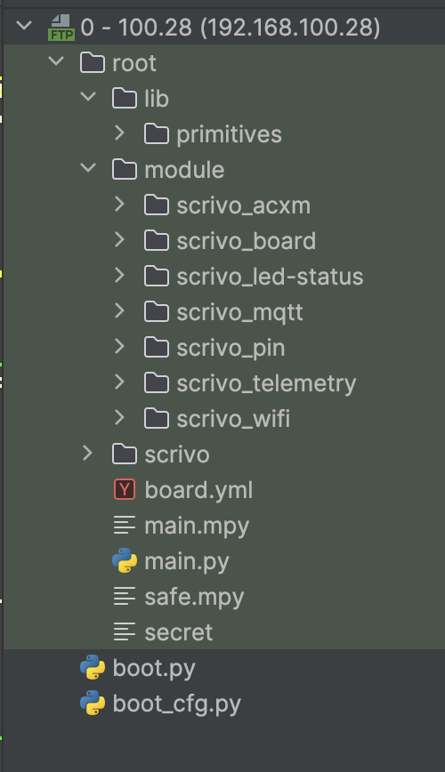
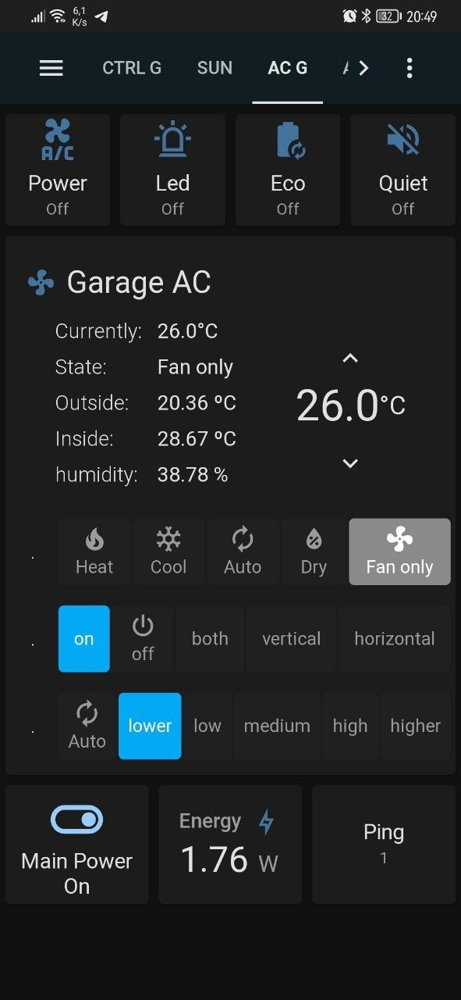

## Hardware

Anu board esp32 with psram. I am use esp32s2 mini.

rename ".secret" "secret"
change wifi ssid key.

### board.yml
acxm:
  - name: "hisense"
  - uart_id: 0
  - uart_rx: 16
  - uart_tx: 17
  - uart_baudrate: 9600
  - mode: "normal"
  - debug: True

 mode: will be
  - sniff - sniffing data from UART - just raw data without detect right packet
 - cloud - use for just receive data from AC to AC. When need get data between AC and cloud.
 - normal - normal mode

 debug: 
    - True
    - ["mag", "raw"]

### FTP

### MQTT Auto discovery

### Home Assistan  will be configure

