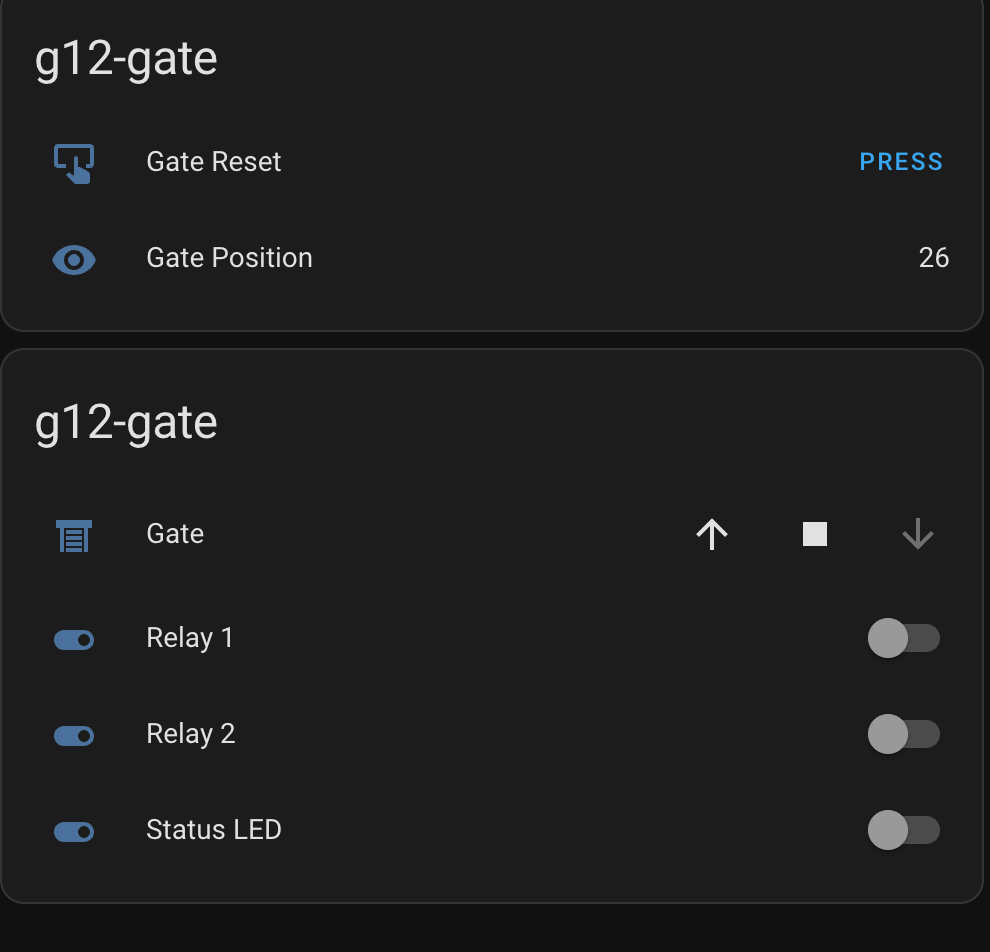

### Hardware

Sonoff DualR3 - need convert *.py -> *.mpy

add "secret" file for safe and wifi.
change wifi ssid key.

### Config 
board.yml
* cover:
  - platform: relay_two
  - id: gate
  - name: "Gate"
  - relay_1: r1
  - relay_2: r2
  - close_duration: 26

### MQTT Auto discovery

